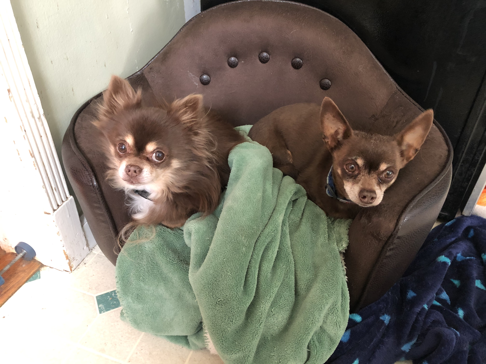

## My simple Python OOP dog class

A few years ago I was hot and heavy with Python. I seriously enjoyed myself but I didn't get where I wanted to go with it.  I decided to take a break from programming.  The little bit of programming muscle I developed all turned to mush.  Now I'm dusting myself off and trying this again.  Last go around I studied OOP but couldn't understand it.  This time things seem a bit obvious.  I wise man once told me *you don't step in the same river twice*.  This go around with Python I'm learning things I hadn't learned before.  I know now that the destination is not as important as the journey.  I'm having fun and that's all that counts.

I've include a picture of my boys.  The long hair chihuahua on left is Bubba Jon and the one on the right is Francis.  BTW Jon is Francis' father.  

